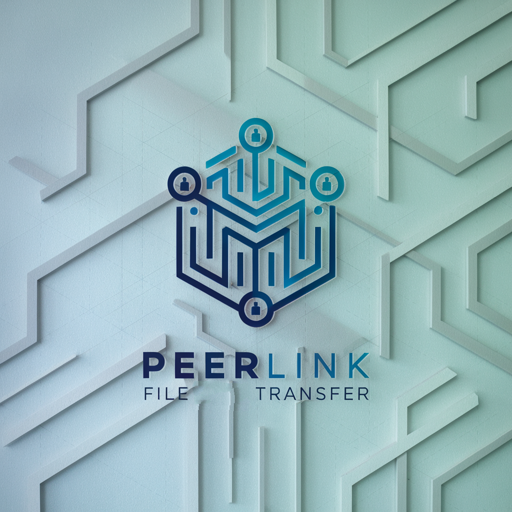

# PeerLink

PeerLink is a robust peer-to-peer (P2P) file transfer application designed to minimize reliance on centralized servers. Leveraging the power of **libp2p** and **IPFS**, PeerLink ensures secure, efficient, and reliable file sharing directly between users.

<p align="center">

</p>

## Table of Contents

- [PeerLink](#peerlink)
  - [Table of Contents](#table-of-contents)
  - [Features](#features)
  - [Usage](#usage)
    - [Sending a File](#sending-a-file)
    - [Receiving a File](#receiving-a-file)
  - [Security](#security)
  - [Contributing](#contributing)
  - [Acknowledgements](#acknowledgements)

## Features

- **Secure File Transfer:** Utilizes Password-Authenticated Key Exchange (PAKE) for secure key exchange, ensuring that only intended recipients can access the files.
- **File Verification:** Implements SHA-256 checksums to verify the integrity of transferred files.
- **File Transfer Confirmation:** Allows the receiver to confirm the file transfer before saving it.
- **Decentralized Networking:** Built on **libp2p** and **IPFS** to provide a decentralized network infrastructure, eliminating the need for centralized servers.
- **Automatic NAT Traversal:** Enables seamless connections across different network configurations using libp2p's automatic NAT traversal features.

## Usage

PeerLink operates through a command-line interface, offering two primary functionalities: sending and receiving files.

### Sending a File

1. **Run PeerLink:**

   ```bash
   go run main.go send <filename>
   ```

2. **Share the Secret Words:**

   After providing the file path, PeerLink generates four secret words. Share these securely with the intended receiver:

   ```
   Share the following four words with the receiver securely:
   word1 word2 word3 word4
   ```

3. **Await Connection:**

   The application waits for the receiver to connect and request the file:

   ```
   Waiting for the receiver to connect and request the file...
   ```

> [!WARNING]
> Sometimes, sending a file may fail due to an error in publishing the CID to the DHT. If this occurs, simply try the process again. This is a known issue with the underlying network and usually resolves on subsequent attempt.
> **If anyone has a fix for this, please do create a PR!**


### Receiving a File

1. **Run PeerLink:**

   ```bash
   go run main.go receive <input-passphrase>
   ```

2. **Confirm File Transfer:**
   You will be prompted to confirm the file transfer:

   ```
   Received file metadata:
   <file metadata>
   Do you want to receive the file? (y/n)
   ```

3. **Specify Save Location:**

   Enter the filename where the received file will be saved:

   ```
   Enter the filename to save the received file:
   ```

   If a file with the specified name already exists, you'll be prompted to confirm overwriting.

4. **Receive and Verify File:**

   PeerLink downloads the file, verifies its integrity using the SHA-256 checksum, and saves it to the specified location.

   ```
   File received successfully
   ```

## Security

PeerLink prioritizes the security and integrity of file transfers through multiple mechanisms:

- **Password-Authenticated Key Exchange (PAKE):** Ensures that the key exchange process is secure and that only parties with the correct secret words can establish a shared encryption key.
- **AES-GCM Encryption:** All data transferred between peers is encrypted using AES-GCM, providing both confidentiality and integrity.
- **SHA-256 Checksums:** Each file transfer includes a SHA-256 checksum to verify that the file has not been tampered with or corrupted during transit.
- **Decentralized Discovery:** Utilizing libp2p's DHT for peer discovery reduces the risk of centralized points of failure or attack.
- **NAT Traversal:** Uses libp2p's automatic NAT traversal features to connect peers behind NATs.
- **Direct Connection:** Even if the receiver is behind a NAT, peerlink uses libp2p's hole punching feature to connect directly.

## Contributing

Contributions are welcome! If you'd like to contribute to PeerLink, please open a pull request.

---

**Disclaimer:** PeerLink is a community-driven project and is provided "as is" without any warranties. Use it at your own risk. Always ensure that you have the necessary permissions to share and access files.

---

## Acknowledgements

- [libp2p](https://github.com/libp2p/go-libp2p)
- [IPFS](https://github.com/ipfs/go-ipfs)
- [PAKE](https://github.com/schollz/pake)
- [pcp](https://github.com/dennis-tra/pcp)
